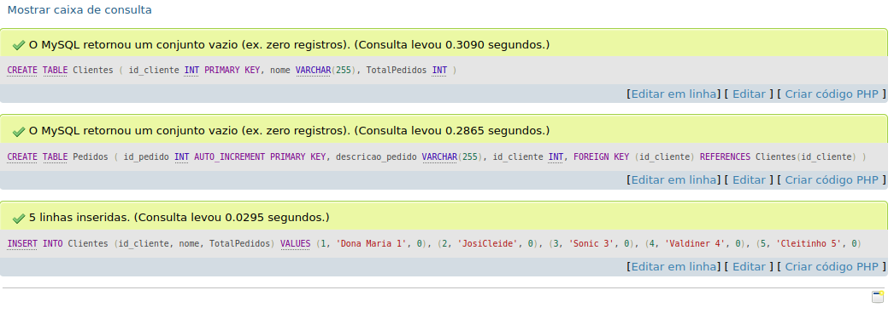
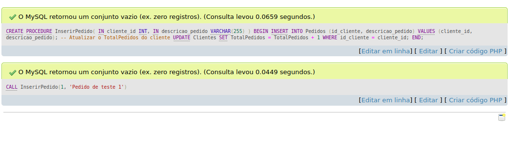
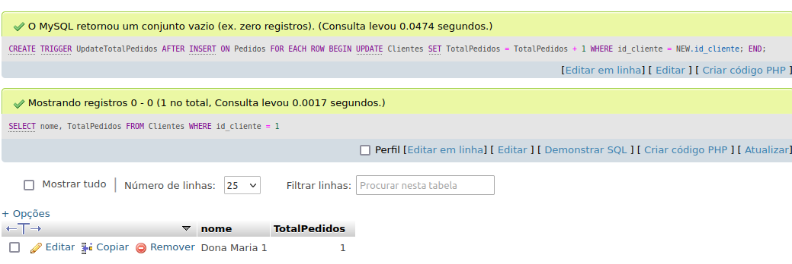
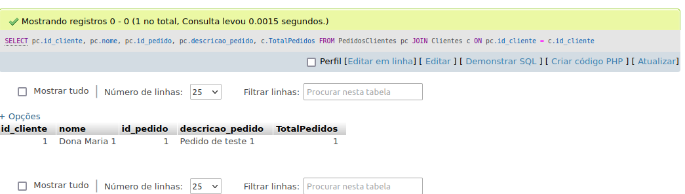

# Atividade individual AF - SQL 

Orientador: Daniel Oatha

<h1>--------  ---------------</h1>

[Link Para Verificar o SQL](https://github.com/Leon14789/GerenciamentoDePedidos/blob/master/sql)

Etapa 1: Criação de Tabelas e Inserção de Dados

<h1>--------  ---------------</h1>

Etapa 2: Criação de Stored Procedure

<h1>--------  ---------------</h1>
Etapa 3: Trigger

<h1>--------  ---------------</h1>

Etapa 4 | 5

